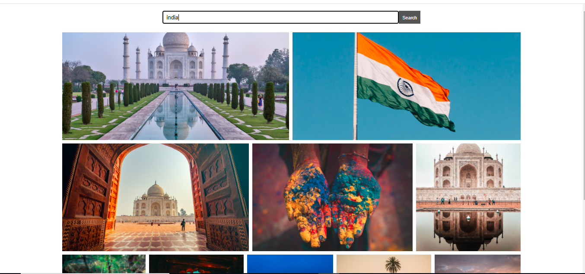
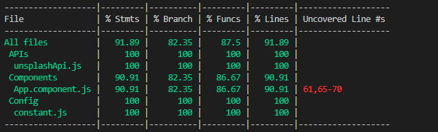

This project is for image search and the API is being used is unsplash [http://unsplash.com/](http://unsplash.com/)

One user can get the images after search button click and he scroll down to bottom, the next page API will call and will come up with more images.

## Screenshot

## Running Web App
[https://images-search-vipin.netlify.app](https://images-search-vipin.netlify.app)

## API Secret Key

Please create account on unsplash and create a app there [https://unsplash.com/oauth/applications](https://unsplash.com/oauth/applications) and copy the AccessKey from there and put in the .\src\Config\constant.js file in API_ACCESS_KEY placeholder.

## Available Scripts

In the project directory, you can run:

### `npm start`

To install all the dependencies.

### `npm start`

Runs the app in the development mode. 
Open [http://localhost:8080](http://localhost:8080) to view it in the browser.

The page will reload if you make edits. 

### `npm test`

Launches the test runner and you could see the test cases status whether it is failed or passed

### `npm run test:coverage`

Runs the test cases and display the coverage of statements, branchs, functions and lines

### `npm run build`

Builds the app for production to the `public` folder. 
It correctly bundles React in production mode and optimizes the build for the best performance.

The build is minified and the filenames include the hashes. 
Your app is ready to be deployed!
